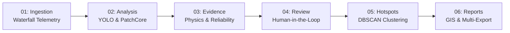

# Sagar-Netra (सागर-नेत्रा) 🌊🛰️
### Deep-Sea Acoustic Debris Intelligence & Side-Scan Sonar Telemetry Platform

[](https://vitejs.dev/)
[](https://react.dev/)
[](https://www.typescriptlang.org/)
[](https://tailwindcss.com/)
[](https://leafletjs.com/)

**Sagar-Netra** is an operational hydrographic survey and marine debris intelligence platform designed for side-scan sonar data processing, multi-modal evidence fusion, human-in-the-loop acoustic verification, and spatial clustering.

---

## 🧭 Architectural Overview: 6-Layer Survey Pipeline

The platform orchestrates end-to-end marine acoustic analysis across six operational layers:



### Layer 01: Survey Ingestion & Waterfall Telemetry
* High-resolution, multi-channel side-scan sonar raw swath stream.
* Slant-range correction, real-time gain calibration (TVG), and water column blanking.
* Dual-frequency telemetry (455 kHz survey search / 900 kHz high-resolution inspection).
* Drag-and-drop batch ingestion with automatic `metadata.csv` mapping (coordinates, depth, speed, towfish altitude).

### Layer 02: Sonar Analysis & Anomaly Detection
* **Dual-Inference Pipeline**:
  * Supervised Object Detection (YOLO) for known marine targets (subsea pipelines, abandoned crab pots, ghost fishing nets, shipwrecks, aircraft fuselages).
  * Unsupervised Visual Anomaly Detection (**PatchCore**) for novel, out-of-distribution (OOD) seabed contacts and anthropogenic anomalies.
* Dual-view synchronization comparing raw acoustic frames with pre-processed, bounding box, and activation heatmap overlays.

### Layer 03: Evidence Intelligence & Reliability Fusion
* Rigorous acoustic validation using physical side-scan sonar principles:
  * Highlight Intensity ($S_{\text{shape}}$)
  * Acoustic Shadow Penumbra ($S_{\text{shadow}}$)
  * Seabed Scour / Environmental Context ($S_{\text{context}}$)
* **Mathematical Reliability Score ($R_{\text{fusion}}$)** calibrated per debris class:
  $$\text{Plane / Wreck}: R = 100 \times (0.20 \cdot C_{\text{AI}} + 0.30 \cdot S_{\text{shape}} + 0.30 \cdot S_{\text{shadow}} + 0.20 \cdot S_{\text{context}})$$
  $$\text{Pipeline}: R = 100 \times (0.15 \cdot C_{\text{AI}} + 0.40 \cdot S_{\text{shape}} + 0.30 \cdot S_{\text{shadow}} + 0.15 \cdot S_{\text{context}})$$
  $$\text{Ghostnet}: R = 100 \times (0.20 \cdot C_{\text{AI}} + 0.40 \cdot S_{\text{shape}} + 0.40 \cdot S_{\text{context}}) \quad (\text{Shadow } W=0)$$
  $$\text{Crab Pot}: R = 100 \times (0.15 \cdot C_{\text{AI}} + 0.35 \cdot S_{\text{shape}} + 0.30 \cdot S_{\text{shadow}} + 0.20 \cdot S_{\text{context}})$$

### Layer 04: Human Review & Anomaly Inspection
* Focused verification queue dedicated to novel anomaly candidate targets (`ANO-001`).
* **Clean 3-Stage Acoustic Verification**:
  1. `Raw image`: Uncompressed side-scan sensor capture.
  2. `Heatmap`: PatchCore memory bank anomaly density activation.
  3. `Bounding box`: Region of interest (ROI) localized detection boundary.
* Operator sign-off decisions with persistent acoustic checklists, verification tags, and formal audit notes.

### Layer 05: Debris Hotspots & Spatial Clustering
* Spatial density grouping using **DBSCAN** ($\varepsilon = 450\,\text{m}$, $\text{MinPts} = 3$).
* Interactive hotspot map visualization powered by Leaflet with cluster polygons, priority color-coding, and centroid telemetry.
* Interactive target preview modal with high-resolution bounding box imagery, coordinates, and cluster statistics.
* Real-time recovery priority ranking (High, Medium, Low) based on cluster target density and mean fusion reliability.

### Layer 06: Reports, Analytics & Hydrographic Export
* **Mission Overview Briefing**: Standard hydrographic mission metadata (Sector 4B, Arabian Sea transect, EdgeTech dual 455/900 kHz payload).
* **12-Target Audit Ledger**: Filterable table with Target IDs (`DET-001` to `DET-012`), Class, Confidence, Reliability ($R$), Depth, Coordinates, and Operator Review Status.
* **4 Operational Export Formats**:
  * 📊 **CSV Export**: Formatted hydrographic ledger for spreadsheet and database ingestion.
  * 🗺️ **GeoJSON Export**: RFC 7946 compliant FeatureCollection (points + cluster polygons) for direct import into **QGIS**, **ArcGIS**, or hydrographic navigation suites.
  * 📋 **Mission JSON**: Full structured mission telemetry, sensor calibration records, and detection manifest.
  * 🖨️ **Print / PDF Briefing**: Clean print-optimized survey summary document.

---

## 📁 Repository Directory Structure

```
Sagar-Netra/
├── public/                       # Static public assets served by Vite
│   ├── ocean-hero.png            # Clean hero backdrop
│   ├── raw/                      # Raw acoustic side-scan sonar captures
│   ├── bbox/                     # Target bounding box crops & annotations
│   ├── bbox_mask/                # Bounding box + segmentation masks
│   ├── PatchCore/                # PatchCore unsupervised anomaly heatmaps
│   ├── pre-processed/            # Enhanced grayscale acoustic imagery
│   ├── shape/                    # Highlight shape contour masks
│   ├── shadow/                   # Acoustic shadow contour masks
│   ├── unknown/                  # Out-of-distribution anomaly detections
│   └── metadata.csv              # Hydrographic survey sensor telemetry
├── src/
│   ├── components/               # Modular UI components
│   │   ├── ActiveSurveyCard.tsx  # Ingestion survey status card
│   │   ├── AppLayout.tsx         # Main operational layout & navigation shell
│   │   ├── DebrisHotspotMap.tsx  # Leaflet GIS hotspot clustering map
│   │   ├── FrameDetailModal.tsx  # Sonar frame inspection modal
│   │   ├── FrameThumbnailGrid.tsx# Ingested sonar thumbnail browser
│   │   ├── IngestedImagePreview.tsx
│   │   ├── IngestionTelemetryPanel.tsx
│   │   ├── Logo.tsx              # Vector Sagar-Netra brand component
│   │   ├── MetadataEditModal.tsx # Hydrographic metadata editor
│   │   ├── Navbar.tsx            # Top operational navigation bar
│   │   ├── PageHeader.tsx        # Standard layer header
│   │   ├── ProcessIndicator.tsx  # Pipeline layer progress breadcrumb
│   │   ├── Sidebar.tsx           # Collapsible mission sidebar
│   │   ├── StatusBadge.tsx       # Severity & status pills
│   │   └── SurveySessionConfig.tsx
│   ├── data/                     # Operational datasets & telemetry models
│   │   ├── sonarAnalysisData.ts  # Detection catalogue & multi-modal paths
│   │   └── surveyWorkflowData.ts # Hotspots, clusters, reviewed ledger
│   ├── pages/                    # 6 Layer Views & Landing
│   │   ├── Landing.tsx           # Mission launch portal
│   │   ├── SurveyIngestion.tsx   # Layer 01
│   │   ├── SonarAnalysis.tsx     # Layer 02
│   │   ├── EvidenceIntelligence.tsx # Layer 03
│   │   ├── HumanReview.tsx       # Layer 04
│   │   ├── DebrisHotspots.tsx    # Layer 05
│   │   └── Reports.tsx           # Layer 06
│   ├── types/                    # TypeScript interfaces & domain models
│   │   └── index.ts
│   ├── utils/                    # Parsing & file system utilities
│   │   ├── fileFolderReader.ts   # Directory traversal & dropped folder reader
│   │   └── metadataParser.ts     # Hydrographic CSV telemetry parser
│   ├── App.tsx                   # React router configuration
│   ├── index.css                 # Tailwind CSS & custom hydrographic styles
│   └── main.tsx                  # Application entry point
├── .gitignore                    # Production git ignore configuration
├── eslint.config.js              # ESLint configuration
├── index.html                    # Single page application template
├── package.json                  # Dependencies & npm scripts
├── postcss.config.js             # PostCSS plugins
├── tailwind.config.js            # Tailwind theme & color tokens
├── tsconfig.json                 # TypeScript compiler configuration
├── tsconfig.app.json
├── tsconfig.node.json
└── vite.config.ts                # Vite build configuration
```

---

## 🚀 Getting Started

### Prerequisites
* **Node.js**: v18.0.0 or higher
* **npm**: v9.0.0 or higher

### Installation

1. **Clone the repository**:
   ```bash
   git clone https://github.com/sidharthkesar0212-blip/Sagar-Netra.git
   cd Sagar-Netra
   ```

2. **Install dependencies**:
   ```bash
   npm install
   ```

3. **Start the development server**:
   ```bash
   npm run dev
   ```
   The application will be accessible at `http://localhost:5173/`.

4. **Build for production**:
   ```bash
   npm run build
   ```

5. **Preview the production build**:
   ```bash
   npm run preview
   ```

---

## 🛠️ Tech Stack & Libraries

| Category | Technology | Purpose |
| :--- | :--- | :--- |
| **Framework** | [React 18](https://react.dev/) | Component architecture & reactivity |
| **Language** | [TypeScript 5](https://www.typescriptlang.org/) | Type-safe hydrographic telemetry & domain models |
| **Bundler** | [Vite 5](https://vitejs.dev/) | High-speed ESM build system & HMR |
| **Styling** | [Tailwind CSS 3](https://tailwindcss.com/) | Tactical dark-mode hydrographic UI |
| **Mapping** | [Leaflet](https://leafletjs.com/) | Geospatial DBSCAN cluster visualization |
| **Icons** | [Lucide React](https://lucide.dev/) | Clean vector operational iconography |
| **Routing** | [React Router DOM 6](https://reactrouter.com/) | Multi-layer SPA routing |

---

## 📄 License
This project is licensed under the MIT License — see the repository for details.
